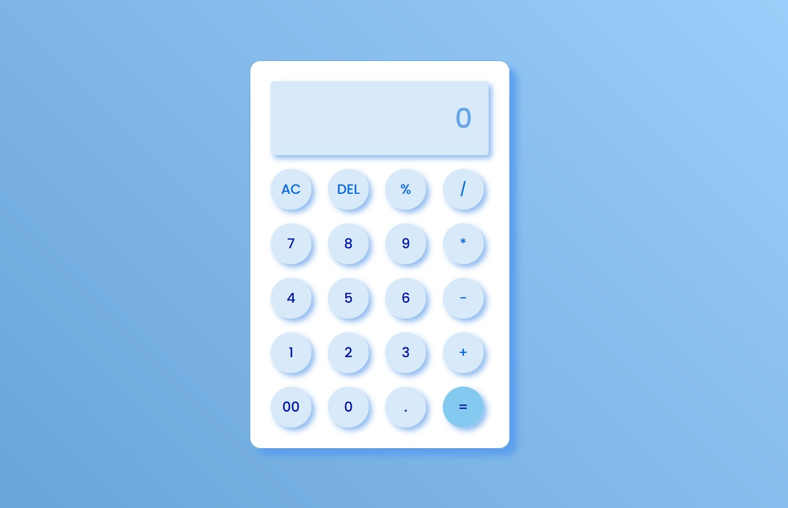

# Simple Javascript Calculator

 A simple calculator using HTML, CSS &amp; Javascript

 

 This is a simple calculator functionality achieved using Javascript. The logic is very simple (you can also try it 😅) with the less lines of code possible .
 Feel free to check out the code and don't forget to star the repository.⭐

### [Live Site](https://github.com/keerti1924/Simple-JavaScript-Calculator.git)

## Execution:
- Download the entire repository.
- Open up the index.html or Run LocalHost:3000 on VsCode.

## Tech Stack used: 
- HTML
- CSS [for style/Presentation]
- Javascript [for Logic/Working of calculator]

## License 

[MIT](LICENSE)

Issued to ```Keerti Vishwkarma``` | All Rights Reserved | 2023

A simple calculator made using HTML, CSS and JavaScript to perform basic mathematical operations with an appealing and responsive UI.

## Functionality

- Can be controlled using either mouse / touchscreen or by using the keyboard pressing the corresponding keys.

- Decimal point can be inserted using both comma or dot key on the keyboard.

- Backspace deletes last digit.

- By keep pressing the equal operator will recalculate result based on the last operation.

- Last operation will show up above the input box every time any of the operators is selected.

## Demo

[](https://github.com/keerti1924/Simple-JavaScript-Calculator.git)

